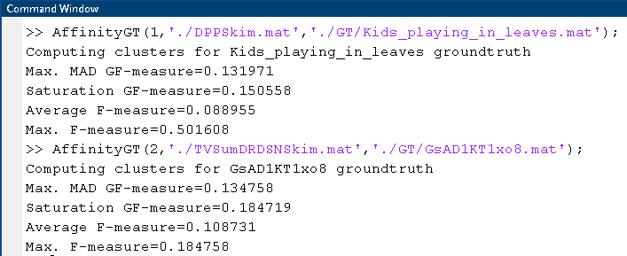

# GranularFmeasure
GFmeasure Calculation, the above code can be executed using the below function call:

  AffinityGT(1,'./DPPSkim.mat','./GT/Kids_playing_in_leaves.mat');

where, the first argument refers to the dataset under consideration 1=> SumMe, 2=>TVSum; the second argument is the summary generated by the algorithm and the third argument gives the path to the ground truth summaries. 
The ground truth summaries for SUMME and TVSum dataset can be found at https://www.kaggle.com/datasets/brothers30sad/summe-dataset, https://github.com/yalesong/tvsum/tree/master/matlab respectively.

The details of the Granular-aware F-measure are present in the paper "Multi-reference Evaluation of Dynamic Video Summaries using Granule-aware F-measure" (Digital Object Identifier or DOI: 10.1109/TETCI.2024.3369855)